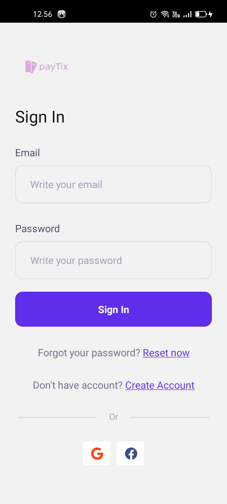

<div align="center">
  
  </div>
  
## Getting Started
  Paytix is an application that can help you in purchasing cinema tickets, Paytix is very easy to use and the interface is understandable by users
  
## Installation

If you want to use paytix you have to use nodejs version [12+](https://nodejs.org/dist/v16.13.1/node-v16.13.1-x64.msi)

Install the dependencies and devDependencies and start the server.

```sh
git clone this repository
cd repository
npm install 
npx react-native link
npx react-native run-android
```
```sh
create file .env in root your project
BASE_URL=yourApiBaseUrl
```

## Build With
- [NodeJs] - Runtime Javascript environment for the backend
- [React Native] - UI Library for cross platform
- [Redux] - state management global
- [Vercel] - Hosting for production
- etc.

## Demo
  
    
      
        
          


